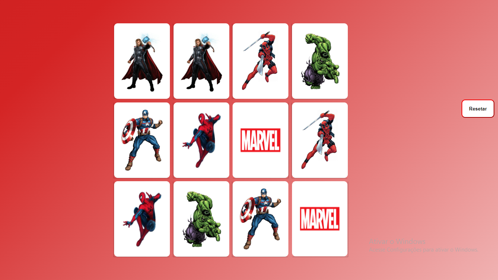

# JOGO DA MEMÓRIA

### Tecnologias utilizadas
  - BORA JOGAR? https://programadorwes.github.io/Jogo_da_memoria/ 
  - HTML
  - CSS3
   - JAVASCRIPT

 <h1 align="center">
    
 </h1>
<h1 align="center">
    
 </h1>
